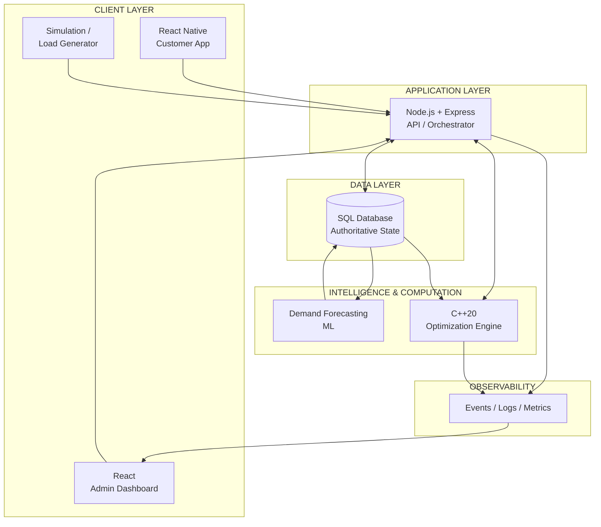
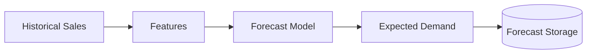
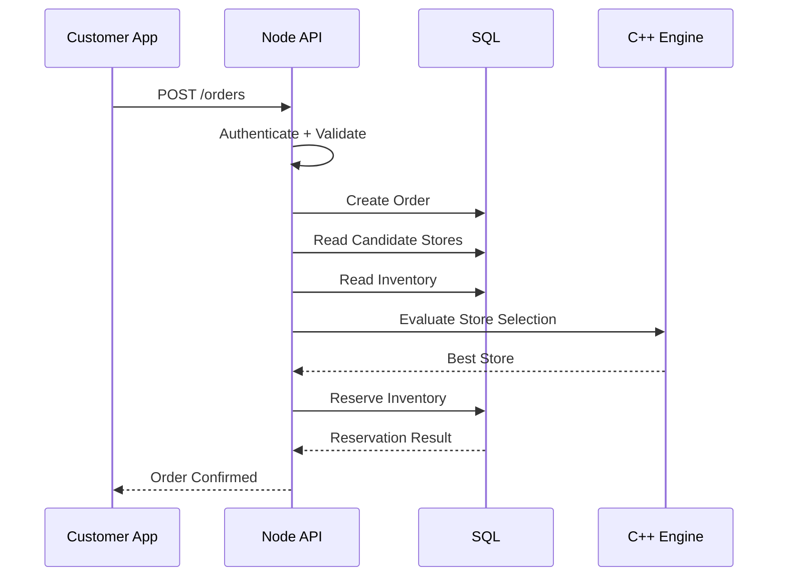
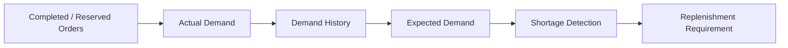
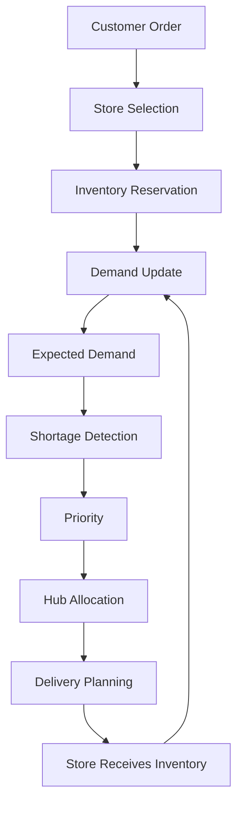

# QuickFlow — System Architecture

> **QuickFlow is a high-performance quick-commerce fulfillment and optimization platform designed to explore how real-time order fulfillment, inventory management, demand forecasting, optimization, simulation, and large-scale performance engineering work together.**

---

## 01 · System at a Glance

QuickFlow models the operational lifecycle of a quick-commerce network:

```text
Customer Order
      ↓
Store Selection
      ↓
Inventory Reservation
      ↓
Demand Update
      ↓
Shortage Detection
      ↓
Replenishment Requirement
      ↓
Hub Allocation
      ↓
Delivery Planning
      ↓
Store Receives Inventory
      ↓
Next Fulfillment Cycle
```

The system is intentionally divided into specialized responsibilities:

| Layer               | Responsibility                                     |
| ------------------- | -------------------------------------------------- |
| **Customer App**    | Customer interaction and order intent              |
| **Admin Dashboard** | Operational visibility and simulation control      |
| **Node.js API**     | Application orchestration and state transitions    |
| **SQL Database**    | Authoritative durable state                        |
| **ML Forecasting**  | Future demand prediction                           |
| **C++ Engine**      | High-performance computational decisions           |
| **Simulation**      | Realistic system workload generation               |
| **Observability**   | Events, metrics, logs and decision traces          |
| **Benchmark Lab**   | Performance and scalability measurement            |
| **Docker / AWS**    | Reproducible execution and scalable infrastructure |

---

# 02 · Architecture



### The central architectural relationship

```text
┌───────────────────────────────────────────────┐
│                  QUICKFLOW                    │
├───────────────────────────────────────────────┤
│                                               │
│  Node       → coordinates the operation       │
│  SQL        → remembers authoritative state   │
│  ML         → predicts future demand         │
│  C++        → computes decisions              │
│  Simulation → creates real workload           │
│  Admin      → exposes system behavior         │
│                                               │
└───────────────────────────────────────────────┘
```

> **Core principle:** Node coordinates. SQL remembers. ML predicts. C++ decides.

---

# 03 · Component Responsibilities

## Customer Application

**Technology:** React Native

The customer application represents the user's intent.

### Responsibilities

* Browse products
* View product information
* Add products to cart
* Place orders
* View order status
* Track fulfillment

### What it does NOT decide

The client never decides:

* Which store should fulfill the order
* Whether inventory can actually be reserved
* How inventory is replenished
* How hub inventory is allocated
* How deliveries are optimized

Those decisions belong to the backend and optimization layers.

---

# 04 · Admin Operations Center

**Technology:** React

The admin dashboard is not a CRUD interface.

It is the **operational window into QuickFlow**.

It should make it possible to watch the system evolve while the simulation is running.

### Operational views

```text
┌──────────────────────────────────────────────┐
│              QUICKFLOW CONTROL                │
├──────────────────────────────────────────────┤
│                                              │
│  Live Simulation                             │
│  ├── Running / Paused                        │
│  ├── Simulation Speed                        │
│  ├── Scenario                                │
│  └── Reset / Control                         │
│                                              │
│  Operations                                  │
│  ├── Orders                                  │
│  ├── Stores                                  │
│  ├── Inventory                               │
│  ├── Demand                                  │
│  ├── Stockouts                               │
│  ├── Replenishment                           │
│  ├── Hub Inventory                           │
│  └── Deliveries                              │
│                                              │
│  Intelligence                                │
│  ├── C++ Decisions                           │
│  ├── Decision Inspector                      │
│  └── Engine Events                           │
│                                              │
│  Performance                                 │
│  ├── Throughput                              │
│  ├── Latency                                 │
│  ├── Engine Runtime                          │
│  └── Resource Usage                          │
│                                              │
└──────────────────────────────────────────────┘
```

The dashboard should answer:

> **"What is QuickFlow doing right now, and why?"**

---

# 05 · Node.js Application Layer

**Technology:** Node.js + Express

Node is the **orchestrator**.

It coordinates operations between clients, SQL, forecasting, and the C++ engine.

### Responsibilities

* API endpoints
* Authentication
* Authorization
* Request validation
* Order orchestration
* State transitions
* Database transactions
* Inventory reservation
* C++ communication
* Applying engine decisions
* Event generation
* Error handling

### Request lifecycle

```text
HTTP Request
     ↓
Authentication
     ↓
Validation
     ↓
Application Logic
     ↓
Read Required State
     ↓
C++ Decision (when required)
     ↓
Database Transaction
     ↓
State Transition
     ↓
Event
     ↓
HTTP Response
```

Node should **not** become the optimization engine.

Large CPU-bound optimization workloads belong in C++.

---

# 06 · SQL Database

The SQL database is the **authoritative source of durable system state**.

Conceptual entities include:

```text
User
Product

Store
StoreInventory

Order
OrderItem

Hub
HubInventory

DemandHistory
DemandForecast

ReplenishmentRequirement
ReplenishmentPlan

Delivery
DeliveryStop
```

### SQL owns

* Persistent state
* Relationships
* Constraints
* Transactions
* Inventory consistency
* Order state
* Replenishment state
* Delivery state
* Historical demand

### Critical boundary

```text
C++ Engine
     ↓
Decision
     ↓
Node
     ↓
SQL Transaction
     ↓
Updated State
```

The C++ engine does **not** directly mutate SQL.

---

# 07 · Demand Forecasting

Demand forecasting answers:

> **"What are we likely to need in the future?"**

The forecasting pipeline is separate from real-time optimization.



Possible forecasting features may include:

* Recent demand
* Day of week
* Historical trends
* Store behavior
* Product behavior
* Seasonality
* Promotions

The architecture should allow the forecasting method to evolve without changing the C++ optimization layer.

---

# 08 · Two Different Clocks

QuickFlow separates forecasting time from operational time.

### Forecasting Clock

Runs periodically or in batches.

```text
Historical Demand
       ↓
Forecasting
       ↓
Expected Demand
       ↓
Store Forecast
```

### Operational Clock

Runs continuously.

```text
Orders
   ↓
Inventory Changes
   ↓
Shortages
   ↓
Optimization
   ↓
Replenishment
```

This prevents expensive forecasting from becoming part of every individual order operation.

---

# 09 · C++ Optimization Engine

**Technology:** C++20

The C++ engine is the **computational core** of QuickFlow.

Its purpose is not merely to "use C++."

Its purpose is to provide a real environment where algorithmic efficiency, memory behavior, concurrency, parallelism, and scaling can be measured.

### Potential modules

```text
engine/
├── models/
├── store-selection/
├── demand/
├── shortage/
├── priority/
├── allocation/
├── replenishment/
├── routing/
├── utilities/
├── benchmarks/
└── tests/
```

### Computational responsibilities

* Store selection
* Demand analysis
* Shortage detection
* Replenishment priority
* Hub allocation
* Replenishment planning
* Delivery planning
* Routing optimization

---

# 10 · C++ Decision Example

Suppose:

```text
Store B
SKU: Milk

Available Inventory : 13
Reserved Inventory  : 2
Expected Demand     : 40
Safety Stock        : 10
Hub Inventory       : 50
```

The engine calculates:

```text
Effective Inventory
= Available - Reserved
= 11
```

```text
Target Inventory
= Expected Demand + Safety Stock
= 50
```

```text
Shortage
= Target - Effective Inventory
= 39
```

The engine can return:

```json
{
  "storeId": "B",
  "sku": "milk",
  "requiredQuantity": 39,
  "priority": "HIGH"
}
```

Node then validates and applies the decision through SQL.

---

# 11 · The Real Order Lifecycle

## Customer places an order



---

# 12 · Inventory Reservation

Inventory reservation is a **state-consistency problem**.

Example:

```text
Store B
Milk = 10

Customer A → 7
Customer B → 6
```

Both requests cannot successfully reserve their requested quantities.

The database must ensure that concurrent requests cannot oversell inventory.

Conceptually:

```text
Request A
    ↓
BEGIN TRANSACTION
    ↓
Lock / validate inventory
    ↓
Reserve 7
    ↓
COMMIT

Request B
    ↓
Wait / re-read state
    ↓
Only remaining inventory is considered
```

### Important distinction

```text
C++ → computational correctness

SQL + transactions → state correctness
```

---

# 13 · Demand → Shortage → Replenishment

After real customer activity changes inventory:



Example:

```text
Current Inventory = 13
Reserved         = 2
Expected Demand  = 40
Safety Stock     = 10

Effective Inventory = 11
Target Inventory    = 50

Shortage = 39
```

The result becomes a replenishment requirement.

---

# 14 · Hub Allocation

Multiple stores can compete for limited hub inventory.

Example:

```text
Hub Inventory
Milk = 50

Store A → needs 30
Store B → needs 25
Store C → needs 15

Total requirement = 70
Available          = 50
```

This becomes a constrained optimization problem.

The C++ engine considers:

* Required quantity
* Priority
* Store urgency
* Available hub inventory
* Other system constraints

Example result:

```text
Store A → 25
Store B → 20
Store C →  5

Allocated = 50
Unmet     = 20
```

The result is then applied by Node.

---

# 15 · Delivery Planning

After allocation:

```text
Hub
 ├── Store A → 25
 ├── Store B → 20
 └── Store C → 5
```

The system can construct a consolidated delivery plan.

```text
Truck
  ↓
Hub
  ↓
Store A
  ↓
Store B
  ↓
Store C
```

Routing complexity can increase over time.

V1 prioritizes a correct end-to-end flow before advanced routing optimization.

---

# 16 · Complete Operational Loop



This loop is the **core business system being simulated and optimized**.

---

# 17 · Simulation Architecture

Simulation is not a fake visualization.

It generates actual workload against the real QuickFlow system.

```text
Virtual Users
      ↓
Customer Behavior
      ↓
Real API Requests
      ↓
Real Orders
      ↓
Real Inventory Changes
      ↓
Real Optimization
      ↓
Real Replenishment
      ↓
Real Deliveries
```

### Virtual user model

```text
Browse
  ↓
Select Product
  ↓
Add to Cart
  ↓
Place Order
  ↓
Check Status
  ↓
Repeat
```

The number of virtual users can increase without requiring one physical device or OS process per user.

---

# 18 · Load Generation

QuickFlow distinguishes between two types of workload.

### Request Load

Actual HTTP traffic:

```text
GET /products
POST /orders
GET /orders/:id
```

### Domain Workload

Actual QuickFlow operations:

```text
Orders
 ↓
Inventory Consumption
 ↓
Demand Changes
 ↓
Stockouts
 ↓
C++ Optimization
 ↓
Replenishment
 ↓
Delivery
```

A meaningful benchmark should measure both.

---

# 19 · Docker and AWS

Docker provides reproducible packaging.

AWS provides scalable infrastructure.

They solve different problems.

```text
Simulation Containers
        ↓
AWS Infrastructure
        ↓
Load Balancer
        ↓
API Instances
        ↓
SQL + C++ Engine
```

Docker does not automatically make QuickFlow faster.

Performance must come from engineering decisions and measurement.

---

# 20 · Observability

QuickFlow should expose its internal behavior through structured events and metrics.

### Important events

```text
ORDER_CREATED
ORDER_ASSIGNED
INVENTORY_RESERVED
ORDER_COMPLETED

DEMAND_UPDATED
SHORTAGE_DETECTED

REPLENISHMENT_CREATED
HUB_ALLOCATION_COMPLETED

DELIVERY_PLANNED
DELIVERY_DISPATCHED
DELIVERY_COMPLETED
```

### Decision trace

The admin dashboard should be able to explain decisions.

Example:

```text
┌─────────────────────────────────────────┐
│ C++ DECISION                            │
├─────────────────────────────────────────┤
│ Store       : B                         │
│ SKU         : Milk                      │
│                                         │
│ Available   : 8                         │
│ Reserved    : 4                         │
│ Effective   : 4                         │
│                                         │
│ Expected    : 30                        │
│ Safety      : 10                        │
│ Target      : 40                        │
│                                         │
│ Shortage    : 36                        │
│ Priority    : HIGH                      │
│                                         │
│ Hub Stock   : 40                        │
│ Allocated   : 32                        │
│ Unmet       : 4                         │
└─────────────────────────────────────────┘
```

This makes the optimization engine explainable rather than a mysterious black box.

---

# 21 · State Machines

## Order

```text
PLACED
  ↓
VALIDATED
  ↓
ASSIGNED
  ↓
RESERVED
  ↓
CONFIRMED
  ↓
PREPARING
  ↓
READY
  ↓
COMPLETED
```

## Delivery

```text
PLANNED
  ↓
PREPARING
  ↓
DISPATCHED
  ↓
IN_TRANSIT
  ↓
ARRIVED
  ↓
COMPLETED
```

## Replenishment

```text
DETECTED
  ↓
PRIORITIZED
  ↓
ALLOCATED
  ↓
PLANNED
  ↓
DISPATCHED
  ↓
DELIVERED
```

Invalid transitions should be rejected by the application layer.

---

# 22 · Failure Model

QuickFlow must preserve valid state when components fail.

### Engine failure

```text
Node
 ↓
C++ Engine
 ↓
Timeout / Failure
 ↓
No partial state mutation
 ↓
Retry / Recovery
```

### Database failure

```text
Operation
 ↓
Transaction
 ↓
Failure
 ↓
Rollback / No invalid state
```

### Duplicate request

Idempotency prevents dangerous operations from executing twice.

### Insufficient hub inventory

This is a business constraint, not necessarily a system failure.

```text
Requested = 70
Available = 50

Allocated = 50
Unmet     = 20
```

### Delivery failure

The delivery state records the failure and allows recovery or replanning.

---

# 23 · Performance Engineering

Performance is not a claim.

It is a measurement.

QuickFlow should benchmark increasing workloads:

```text
1K
 ↓
10K
 ↓
100K
 ↓
1M
 ↓
10M+
```

Measurements include:

| Metric             | Purpose                               |
| ------------------ | ------------------------------------- |
| **Latency**        | How long operations take              |
| **Throughput**     | Operations processed per unit time    |
| **CPU**            | Computational utilization             |
| **Memory**         | Memory consumption                    |
| **Engine Runtime** | C++ algorithm performance             |
| **DB Performance** | Persistence bottlenecks               |
| **Concurrency**    | Behavior under simultaneous work      |
| **Scaling**        | How performance changes with workload |

No benchmark numbers should be invented.

Every performance claim must eventually come from an experiment.

---

# 24 · Two Performance Tracks

## System Scalability

```text
Virtual Users
      ↓
HTTP Requests
      ↓
Load Balancer
      ↓
Node Instances
      ↓
SQL + C++
```

Measures the performance of the complete application.

## Algorithm Scalability

```text
Large Optimization Dataset
          ↓
      C++ Engine
          ↓
Runtime / CPU / Memory
```

Measures how optimization algorithms behave as the problem size grows.

Both matter.

---

# 25 · V1 System

V1 deliberately starts with:

```text
1 Hub
3 Stores
5 SKUs
1 Truck
Multiple Customers
Multiple Orders
Limited Hub Inventory
```

The goal is not scale for the sake of scale.

The goal is to make the **entire system loop real**.

```text
Order
 ↓
Store Selection
 ↓
Reservation
 ↓
Demand
 ↓
Shortage
 ↓
Replenishment
 ↓
Hub Allocation
 ↓
Delivery
 ↓
Inventory Restored
```

Once this works correctly, the workload can be scaled.

---

# 26 · Scaling Path

The architecture should eventually support:

```text
V1
1 Hub
3 Stores
5 SKUs
       ↓
Multiple Hubs
Multiple Stores
Large SKU Catalog
       ↓
Large Order Volume
Large Simulation
       ↓
Parallel C++ Workloads
       ↓
Distributed Load Generation
       ↓
Cloud Deployment
       ↓
Measured Scaling
```

Complexity is introduced when the workload or measurements justify it.

---

# 27 · Architectural Philosophy

QuickFlow is intentionally built around a simple principle:

> **Do not add complexity because it sounds impressive. Add it because the system has demonstrated a need for it.**

The engineering loop is:

```text
Build
  ↓
Measure
  ↓
Find Bottleneck
  ↓
Understand Cause
  ↓
Optimize
  ↓
Measure Again
```

This applies to:

* Algorithms
* Database queries
* API performance
* Concurrency
* Memory usage
* CPU utilization
* Network communication
* Infrastructure

---

# 28 · Quick Reference

| Component    | Primary Responsibility  |
| ------------ | ----------------------- |
| React Native | Customer interaction    |
| React        | Operations visibility   |
| Node.js      | Orchestration           |
| SQL          | Durable state           |
| ML           | Demand prediction       |
| C++20        | Optimization            |
| Simulation   | Workload generation     |
| Events       | System observability    |
| Benchmarks   | Performance evidence    |
| Docker       | Reproducible execution  |
| AWS          | Scalable infrastructure |

### The one-line architecture

```text
Customer intent → Node orchestration → SQL state → C++ decision → Node applies → SQL changes → Events → Admin observes
```

---

## Architecture Status

**Current phase:** Foundation & System Architecture

**V1 status:** Architecture under active design

**Implementation status:** Not yet frozen

The architecture will be updated as decisions are reviewed, tested, measured, and frozen.
